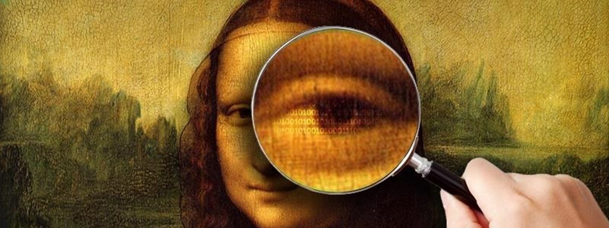
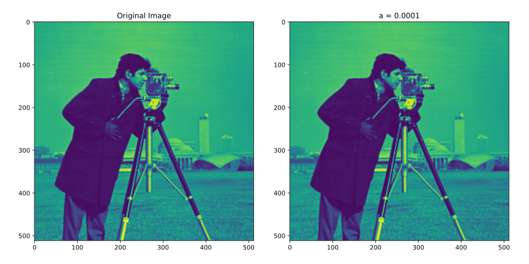

# Steganography via Least Squares

*Numerical Optimization and Large Scale Linear Algebra*  
*MSc in Data Science, Department of Informatics*  
*Athens University of Economics and Business*

## *Table of Contents*

1. [Introduction](#introduction)
2. [Project Overview](#project-overview)
3. [Resources](#resources)
4. [Results & Conclusion](#results--conclusion)

## *Introduction*

- In steganography, a secret message is embedded in an image in such a way that the image looks the same
- In this project, we explore a simple approach to steganography that relies on constrained least squares
- The secret message is given by a $k$-vector $s$ with entries that are all either +$1$ or -$1$ (boolean vector)
- The original image is given by the $n$-vector $x$, where $n$ is usually much larger than $k$
- We send (or publish or transmit) the modified message $x+z$, where $z$ is an $n$-vector of modifications
- We would like $z$ to be small, so that the original image $x$ and the modified one $x+z$ look (almost) the same
- Our accomplice decodes the message $s$ by multiplying the modified image by a $k \times n$ matrix $D$
- The multiplication yields the $k$-vector $y = D(x + z)$
- The message is then decoded as $\hat{s}=sign(y)$
- The matrix $D$ must have linearly independent rows, but otherwise is arbitrary

## *Project Overview*

- We need to minimize $\|z\|^{2}$ subject to the equality constraint $D(x+z)=\alpha s$, which we can write as $Dz=\alpha s-Dx$
- This is a least norm problem, with solution (assuming that $D$ has linearly independent rows) $z=D^{†}(\alpha s-Dx)$
- We generate the matrix  $D $ randomly and normalize it to have norm $\| D \|=1$, and compute $D^{†}$
- The modified image  $x+z $ may have entries outside the range $[0, 1]$
- We replace any negative values in the modified image with zero, and any values greater than one with one
- We adjust $\alpha$ until the original and modified images look the same, but the message is decoded correctly

## *Resources*

- Packages: `numpy`, `pandas`, `matplotlib`, `seaborn`, `sklearn`
- Software: Jupyter Notebook

## *Results & Conclusion*

- The higher the value of $\alpha$, the more noise is added to the image
- The more noise we add to the image, the easier it is to encode and decode clearly a secret message
- In our case, we used the word "hello" as the secret message
- We tried a few different values of $\alpha$ for encoding and decoding the message
- For $\alpha=0.0001$ we can encode and decode the secret message, without the image carrying any noise
- The decoding accuracy at this value of $\alpha$ was 100%
- The model was able to correctly estimate and decode all 40 bytes of the secret message

